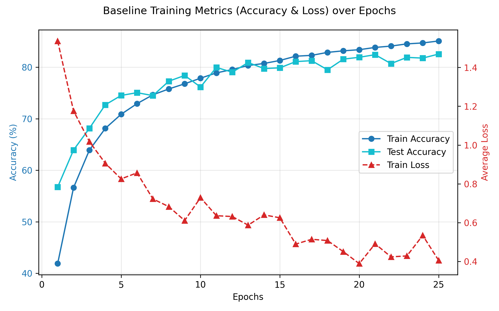
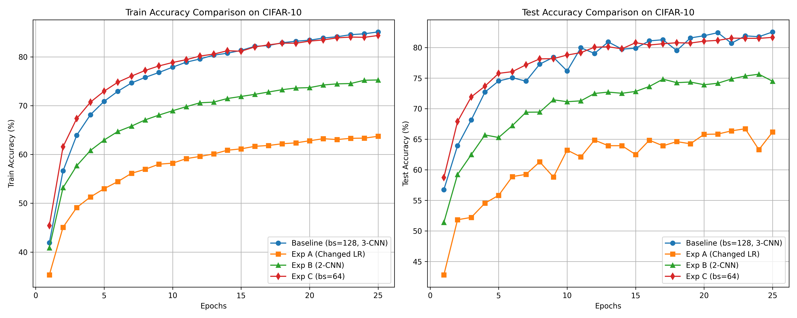

# 人工智能基础 第二次实践作业 实验报告

## 1. 基础模型结构与超参数选取

构建含三个卷积层和两个全连接层的 CNN

**网络结构：**

 - 第一层：Conv2d(3 -> 32) + MaxPool2d + ReLU
 - 第二层：Conv2d(32 -> 64) + MaxPool2d + ReLU
 - 第三层：Conv2d(64 -> 128) + MaxPool2d + ReLU
 - 全连接层：第一层 (128\*4\*4 -> 512) -> ReLU -> 第二层 (512 -> 10)

**数据增强：**

使用 `RandomCrop(32, padding=4)`、`RandomHorizontalFlip()` 和 `ColorJitter` 增强模型的泛化能力

**超参数：**

Optimizer 选择 Adam，Batch Size 为 128，引入交叉熵损失函数，默认学习率设定为 $0.001$，训练 $25$ 个 Epoch

此 baseline 设定能平稳收敛，经过 25 个 Epoch 之后，在测试集上的准确率达到 $81.78\% \gt 80\%$

如下曲线图展示了每个 Epoch 的平均 Loss、Train Accuracy 和 Test Accuracy：

## 2. 结构与超参数调优

在其他参数与超参数不变的情况下，分别调整 Learning Rate、CNN 结构和 Batch Size

$4$ 种方式下每个 Epoch 后的 Train Accuracy 和 Test Accuracy 如下：

| 组别                     | 具体修改                  | Train Acc | Test Acc | 结论                                     |
| :----------------------- | :------------------------ | :-------- | :------- | :--------------------------------------- |
| **Baseline**             | lr=0.001，bs=128，3层卷积 | 84.72%    | 81.78%   | 表现最好，达到 Acc>80% 目标              |
| **Exp A: Learning Rate** | lr = 0.005                | 63.34%    | 63.29%   | 不收敛，Loss波动极大                     |
| **Exp B: 网络结构**      | 2层卷积+缩减通道          | 75.20%    | 75.64%   | 模型容量缩水，出现轻微欠拟合             |
| **Exp C: Batch Size**    | bs = 64                   | 84.00%    | 81.51%   | 泛化效果接近Baseline，但单步产生轻微波动 |

### 2.1 Exp A：调整 Learning Rate

> 对应 `cifar10_cnn1.py` / `training_lr.log`

在原模型结构基础上，仅将 Learning Rate 从 $0.001$ 调整为 $0.005$（过大）

- 25个 Epoch 后，Train Accuracy 和 Test Accuracy 仅停留在 63.34% 和 63.29%，无法继续向下收敛
- 过大的 Learning Rate 导致 Loss 震荡严重，参数在最优解附近反复横跳却无法抵达局部极小值

**结论**: Learning Rate 是优化中最关键的部分，对于一般的 CNN 和 Adam 优化器而言，$0.001$ 大致能保证快速稳定收敛且不在最优点周围震荡

### 2.2 Exp B：调整网络结构

> 对应 `cifar10_cnn2.py` / `training_struc.log`

将原本 3 层卷积 + 512 维全连接的深层网络缩减至 2 层卷积 + 256 维全连接的简单网络

- 极简结构的训练速度有所提升，但最终模型容量存在瓶颈，25 个 Epoch 后 Train Accuracy 为 75.20%，Test Accuracy 为 75.64% 左右
- 与 baseline 的 81.78% 相比，Test Accuracy 有明显下降，由于该极浅层的感受野偏小且特征通道少，无法提取出 CIFAR-10 这样略复杂的非线性图片特征，模型处于轻微的欠拟合状态

**结论**: 在一定限度内，网络感受野的设计和宽度的增加能显著提升模型刻画隐层特征的能力

### 2.3 Exp C：调整 Batch Size

> 对应 `cifar10_cnn3.py` / `training_bs.log`

将 Batch Size 从 $128$ 缩小至 $64$，导致一个 Epoch 需要的总 Step 数量从 391 提高到 782 次

- 缩减 Batch 相当于在单位轮次内发生了更多次梯度迭代和参数更新，可以观察到最终的 Test Accuracy 与调整前相近，保持了良好的泛化结果
- 由于 Batch Size 变小，计算梯度时单个 Batch 的样本噪音增加，Loss 数值展现出了更明显一点的波动表现

**结论**: 缩小 Batch Size 能带来精度的突变，但使得梯度计算带有一定的随机性，对于某些容易陷入鞍点的任务是有利的
